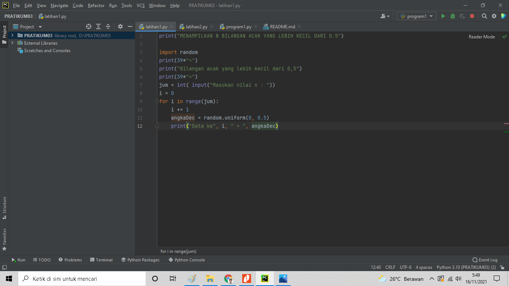
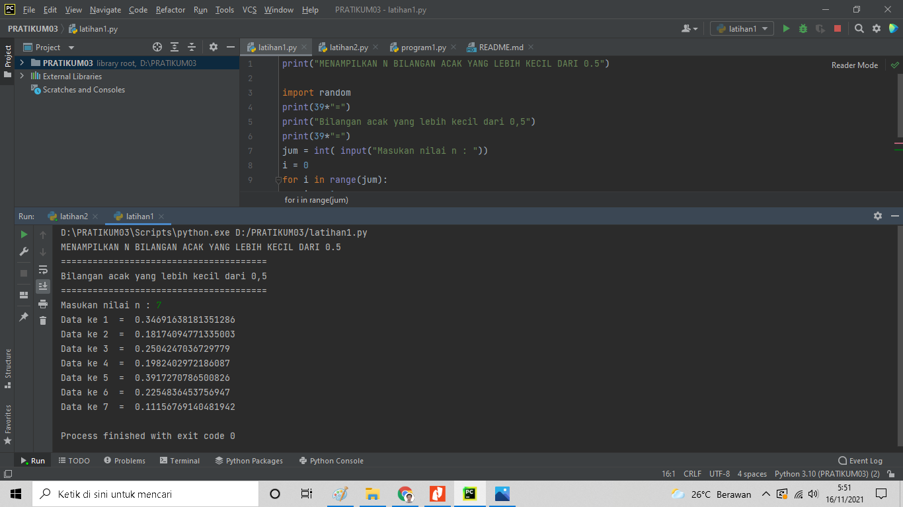
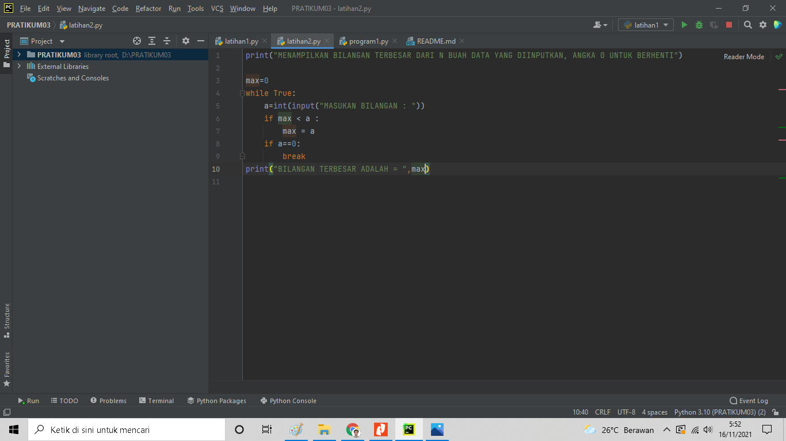
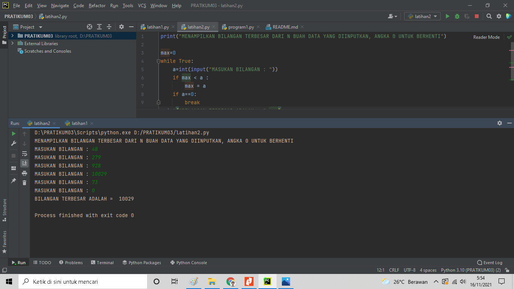
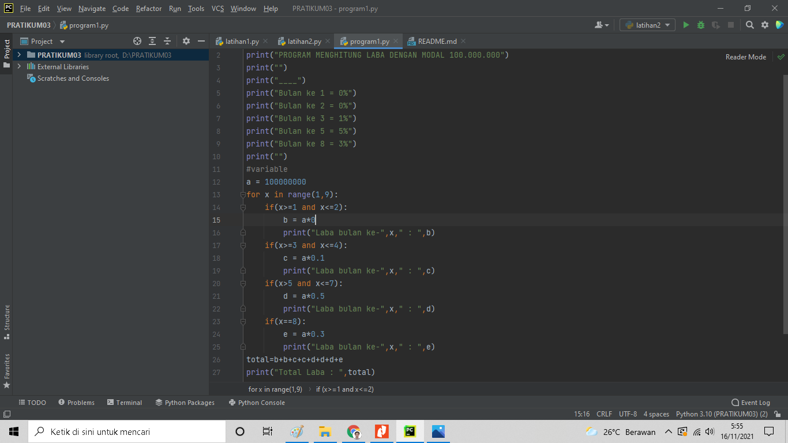

## Tugas  Praktikum 3
Kabul Ramdhan | 311810315 | TI.18.B2 | Bahasa Pemrograman

## Latihan 1

1. Tampilkan n bilangan acak yang lebih kecil dari 0,5.
2. Nilai n diisi pada saat RUN time
3. Anda bisa menggunakan kombinasi while dan for untuk menyelesaikannya
4. Gunakan fungsi random () yang dapat di infort terlebih dahulu

#### Struktur Algoritma

Menampilkan n bilangan acak yang lebih kecil dari 0,5 nilai n diisi pada
saat RUN time

1. Import fungsi RANDOM
2. Deklarasi interger, masukan jumlah3. Masukan deskripsi kombinasi for
4. Masukan nilai jumlah (n) : 5
5. Mencetak data ke 1 sampai 7 dengan hasil nilai kurang dari 0,5.
6. Selesai

### Source Code

#### TAMPILAN RUN PROGRAM 

 

***

## Latihan 2

  Membuat program untuk menampilkan bilangan terbesar dari n buah data 
yang diinputkan. Masukkan angka 0 untuk berhenti.

#### Struktur Algoritma

 Membuat program untuk menampilkan bilangan terbesar dari n buah data 
yang diinputkan.Masukkan angka 0 untuk berhenti

1. Mulai

2. Mencetak "latihan 2"

3. Mencetak "menampilkan bilangan, berhenti ketika bilangan 0, 
menampilkan bilangan terbesar"

4. integer max = 0

5. Menggunakan fungsi perulangan while true, hingga menampilkan 
perulangan sampai batas tertentu.

6. Memasukan bilangan integer pada "a"

7. Menggunakan fungsi if jika max kurang dari nilai a, maka max sama 
dengan a

8. Mengunakan fungsi if jika nilai a adalah 0 maka fungsi break artinya 
perulangan berhenti jika menulis nilai 0.

9. Mencetak nilai paling terbesarv setelah break, sehingga menampilkan 
nilai terbesar diantara bilangan tersebut dalam perulangan.

10. Selesai

### Source Code

 

### TAMPILAN RUN PROGRAM

***

## program 1

Membuat program sederhana dengan perulangan :

Seorang pengusaha menginvestasikan uangnya untuk memulai usahanya 
dengan modal awal 100 juta,

- Pada bulan pertama dan kedua belum mendapatkan laba.

- Pada bulan ketiga baru mulia mendapatkan laba sebesar 1%

- Pada bulan ke lima pendapatan meningkat 5%

- Pada bulan ke delapan mengalami penurunan keuntungan sebesar 2%, 
sehingga laba menjadi 3%.

- Hitung total keuntungan selama 8 bulan berjalan usahanya.

#### Struktur Algoritma

1. Mulai

2. Mencetak latihan1

3. Mencetak "Program menghitung laba dengan modal awal 100 juta"

4. Mencetak Bulan pertama dan kedua = 0%

5. Mencetak bulan ke 3 = 1%

6. Mencetak bulan ke 5 = 5%

7. Mencetak bulan ke 8 = 2%

8. integer a = 100.000.000( modal awal)

10. Menggunakan fungsi looping for pada nilai x 1-9 untuk menampilkan 
bulan 1 sampai bulan 8.

11. Menggunakan fungsi if, untuk menghitung laba bulan 1 sampai 8

12. bulan pertama dan kedua laba adalah 0

13. bulan ke 3 dan ke 4 mendapat laba 1% sehingga modal di kali 1% = 
keuntungan

14. bulan ke 5 mendapatkan laba 5%, sehingga modal dikali 5% = 
keuntungan

15. Bulan ke 8 mmendapatkan laba 2% sehingga keuntungan menurun dari 
bulan sebelumnya, modal dikali 2% = keuntungan.

16. Menghitung jumlah total laba dengan menjumlah keuntungan dari bulan 
ke 1 sampai bulan 8, hasilnya adalah total keuntungan yang didapat.

17. Selesai

### Source Code

### TAMPILAN RUN PROGRAM

